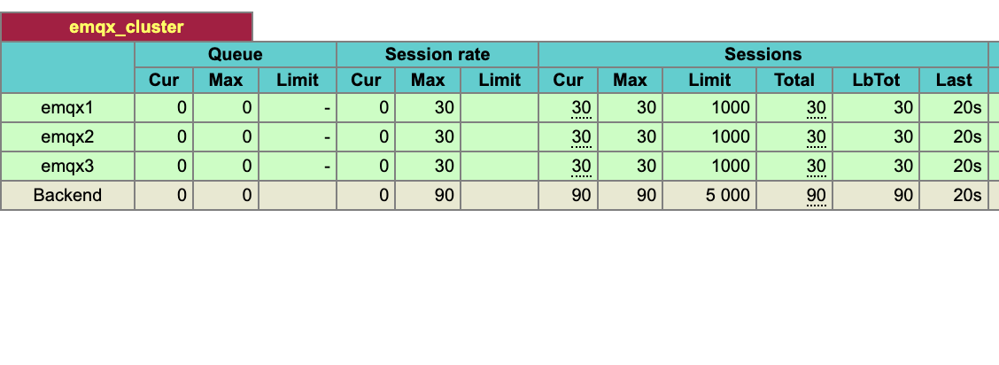
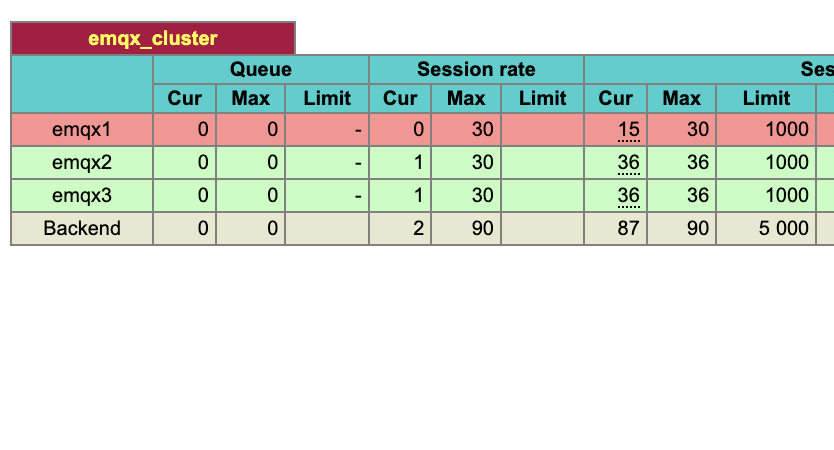
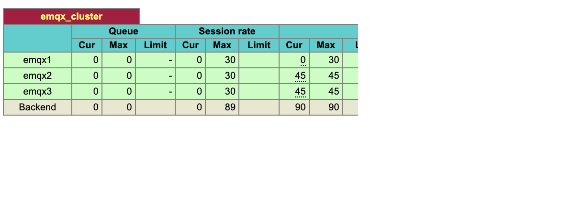

# EMQX Node Rebalance

## Motivation

EMQX is a high-performance distributed MQTT broker. Being distributed, it can be deployed in a cluster of nodes,
so scaling up and down is a natural activity.

However, with MQTT, scaling up and down is not as simple as adding or removing nodes from the cluster.

Unlike, e.g. HTTP, it is natural for MQTT clients to maintain a long-lived connection to the broker. When a new node appears in the cluster, clients do not automatically connect to it because many of them use their existing connections. This means that the new node may stay underpopulated for a long time.

Also, MQTT is a stateful protocol. So, for graceful maintenance of a node, it is necessary to migrate the clients from the node that is being removed or updated. Unlike HTTP, we cannot simply remove a node from the load balancer and wait for the clients to reconnect to another node, because it may take a long time for them to reconnect.

In this article, we will look at how EMQX solves this problem. The solution is also used in EMQX Cloud, a managed MQTT service based on EMQX.

## Rebalance vs Evacuation

In EMQX, we have two somewhat opposite rebalancing operations: rebalance and evacuation.

Evacuation is used when we want to remove all clients and their states from a node. This may be necessary if we want to remove the node totally because of scaling down or maybe if we want to make some maintenance on the node, e.g. upgrade software or hardware.

Rebalance is used when for some reason we have underpopulated nodes in the cluster. Usually, this happens when we add new nodes. Rebalance is used to distribute the clients and their states more evenly across the cluster.

To demonstrate, we will do the following:
* Create a cluster of three EMQX nodes.
* Then, we evacuate one of the nodes for some implied maintenance.
* Finally, we rebalance the cluster back to distribute the clients across the cluster's three nodes.

We use relatively small numbers of clients and connections for better observability. In real life, the number of clients and connections should be much larger to make the process make sense. With a large number of clients the pace of evacuation and rebalance can be configured to be much faster, and the thresholds can be configured to be more loose.

## Creating a Cluster

For convenience and reproducibility, we will use Docker Compose to create the cluster.

We use the following `docker-compose.yml`. Together with other used files, it can be found in the [GitHub repository](https://github.com/emqx/emqx-rebalance-article).

```yaml
version: '3'

services:
  emqx1:
    image: emqx/emqx-enterprise:5.1.0
    container_name: emqx1
    environment:
    - "EMQX_NODE__COOKIE=emqx_dist_insecure_cookie"
    - "EMQX_NODE_NAME=emqx@node1.emqx.io"
    - "EMQX_CLUSTER__DISCOVERY_STRATEGY=static"
    - "EMQX_CLUSTER__STATIC__SEEDS=[emqx@node1.emqx.io,emqx@node2.emqx.io,emqx@node3.emqx.io]"
    - "EMQX_LOG__CONSOLE_HANDLER__LEVEL=info"
    - "EMQX_API_KEY__BOOTSTRAP_FILE=/opt/emqx/etc/api-keys.txt"
    healthcheck:
      test: ["CMD", "/opt/emqx/bin/emqx", "ctl", "status"]
      interval: 5s
      timeout: 25s
      retries: 5
    volumes:
      - ./api-keys.txt:/opt/emqx/etc/api-keys.txt:ro
    networks:
      emqx-bridge:
        aliases:
        - node1.emqx.io
    ports:
      - "18083:18083"

  emqx2:
    image: emqx/emqx-enterprise:5.1.0
    # ...
    # similar to emqx1
  emqx3:
    image: emqx/emqx-enterprise:5.1.0
    # ...
    # similar to emqx1

  haproxy:
    image: haproxy:latest
    container_name: haproxy
    depends_on:
      emqx1:
        condition: service_healthy
      emqx2:
        condition: service_healthy
      emqx3:
        condition: service_healthy
    ports:
      - "1883:1883"
      - "8080:8080"
    volumes:
      - ./haproxy.cfg:/usr/local/etc/haproxy/haproxy.cfg:ro
    networks:
      emqx-bridge:
        aliases:
        - lb.emqx.io

  mqttx:
    image: emqx/mqttx:latest
    container_name: mqttx
    build: ./mqttx
    depends_on:
      - haproxy
    networks:
      emqx-bridge:
        aliases:
        - client.emqx.io
    command:
      - sleep 5 && mqttx bench sub --count 90 --qos 1 --topic 'test/#' --hostname lb.emqx.io --port 1883 --no-clean
networks:
  emqx-bridge:
    driver: bridge
```

In docker-compose.yml, we set up the following services:
* Three EMQX nodes, `emqx1`, `emqx2`, and `emqx3`. They are configured to form a statically configured cluster.
* An HAProxy load balancer, `haproxy`, is configured to balance MQTT traffic to the EMQX cluster.
* An MQTT client, [`mqttx`](https://mqttx.app), is configured to create 90 test clients. The clients are configured to connect with `--no-clean` flag, which means that they will have a server-side state even after the disconnection.

To the host machine, we expose the following ports:
* 1883 - MQTT port of the HAProxy load balancer.
* 8080 - The port of HAProxy statistics page.
* 18083 - The port of the EMQX dashboard. It is exposed from the `emqx1` node, but all the nodes can be inspected through it because they form a cluster.

We start HAProxy with the following configuration([haproxy.cfg](https://github.com/emqx/emqx-rebalance-article/blob/main/dc/haproxy.cfg)):

```haproxy
listen stats
  bind *:8080
  mode http
  stats enable
  stats hide-version
  stats uri /

listen mqtt
  bind *:1883
  mode tcp
  maxconn 50000
  timeout client 6000s
  default_backend emqx_cluster

backend emqx_cluster
  mode tcp
  balance leastconn
  option httpchk
  http-check send meth GET uri /api/v5/load_rebalance/availability_check hdr Authorization "Basic a2V5OnNlY3JldA=="
  server emqx1 node1.emqx.io:1883 check port 18083 inter 1000 fall 2 rise 5 weight 1 maxconn 1000
  server emqx2 node2.emqx.io:1883 check port 18083 inter 1000 fall 2 rise 5 weight 1 maxconn 1000
  server emqx3 node3.emqx.io:1883 check port 18083 inter 1000 fall 2 rise 5 weight 1 maxconn 1000
```

In the configuration, we set up the following:
* A statistics page on port 8080.
* A TCP listener on port 1883 for MQTT connections.
* `emqx_cluster` backend balancing connections among three servers(EMQX nodes). The used strategy is `leastconn`, that is, the new clients will be balanced to the live server with the least amount of connections.
* Health checks of the EMQX nodes. A special URL is used for health checks, and nodes may report to be unhealthy if they are in the process of rebalancing or evacuation.

So, let us start the cluster and wait a bit to let the clients connect:

```bash
$ git clone https://github.com/emqx/emqx-rebalance-article.git
$ cd emqx-rebalance-article/dc
$ docker compose up --build
```

After a while, we can see that the clients are connected to the cluster:
```
... many lines omitted ...
mqttx    | ✔  success   [90/90] - Connected
mqttx    | …  awaiting  [90/90] - Subscribing to test/#...
emqx3    | 2023-08-31T17:13:45.122325+00:00 [info] msg: authorization_permission_allowed, mfa: emqx_authz:log_allowed/1, line: 431, peername: 192.168.240.5:41192, clientid: mqttx_9dcd3212_90, topic: test/#, ipaddr: {192,168,240,5}, source: file, username: undefined
mqttx    | ✔  success   [90/90] - Subscribed to test/#
```

If we go to the EMQX dashboard (http://localhost:18083), we can see that the clients are equally distributed among the three nodes.

Also, in the HAProxy statistics page (http://localhost:8080), we also see that the load balancer has distributed the connections among the three nodes (we are interested in the `cur` column in Sessions):



## Evacuation

We will start with evacuation. Its main properties are:
* Evacuation is a _process_ taking place on a **single node**.
* Evacuation is **persistent**. That means, that the node keeps its state on disk/data volume and preserves its evacuating state even after restart. Evacuation should be disabled explicitly.

The scenario of evacuation is the following:

* When evacuation starts on a node, it starts to report itself as unhealthy to the load balancer.
* The load balancer marks the node as unhealthy and stops sending new connections to the node.
* After some time, the node starts to reject new connections itself and also starts to disconnect existing clients.
* After all the clients are disconnected, the node starts to wait for some time again to let the clients reconnect to other nodes and take over their states.
* After the waiting time is over, the node starts explicitly transferring the states of the clients to other nodes.
* After the transfer is over, the evacuation transitions to the final state, where the node is empty, still marked as unhealthy and does not accept new connections, but no other actions are taken.

The parameters of evacuation like waiting times and rates of connection and session evictions can be configured.

We will evacuate `emqx1` node, let's connect to it in a new shell and start evacuation:

```bash
$ docker exec -it emqx1 bash
emqx@7832a3427ebb:/opt/emqx$ ./bin/emqx_ctl rebalance start --evacuation --wait-health-check 15 --conn-evict-rate 3 --wait-takeover 15 --sess-evict-rate 3
```

In Docker Compose shell we see that evacuation has started:

```
emqx1    | 2023-08-31T14:39:59.338068+00:00 [warning] msg: node_evacuation_started, mfa: emqx_node_rebalance_evacuation:handle_event/4, line: 130, opts: #{conn_evict_rate => 3,migrate_to => undefined,server_reference => undefined,sess_evict_rate => 3,wait_health_check => 15,wait_takeover => 15}
...
haproxy  | [WARNING]  (8) : Server emqx_cluster/emqx1 is DOWN, reason: Layer7 wrong status, code: 503, info: "Service Unavailable", check duration: 4ms. 2 active and 0 backup servers left. 30 sessions active, 0 requeued, 0 remaining in queue.
```

After a little while, we see that HAProxy has marked the node as unhealthy and stopped sending new connections to it.

If we switch to the HAProxy statistics page, we see that the node is marked as unhealthy, but all the connections to `emqx1` are still alive.


After the specified 15-second interval, we see that the node has started to disconnect the clients with the configured pace: 3 connections per second (`conn_evict_rate`).

```
emqx1    | 2023-08-31T14:40:14.343116+00:00 [warning] msg: node_evacuation_evict_conns, mfa: emqx_node_rebalance_evacuation:handle_event/4, line: 207, conn_evict_rate: 3, count: 30
mqttx    | [8/31/2023] [2:40:14 PM] › ✖  [89/90] - Client ID: mqttx_5c689ffd_22, Connection closed
mqttx    | [8/31/2023] [2:40:14 PM] › ✖  [88/90] - Client ID: mqttx_5c689ffd_46, Connection closed
mqttx    | [8/31/2023] [2:40:14 PM] › ✖  [87/90] - Client ID: mqttx_5c689ffd_88, Connection closed
mqttx    | [8/31/2023] [2:40:15 PM] › ℹ  Received total: 0, rate: 0/s
mqttx    | [8/31/2023] [2:40:15 PM] › ✖  [86/90] - Client ID: mqttx_5c689ffd_10, Connection closed
emqx1    | 2023-08-31T14:40:15.345040+00:00 [warning] msg: node_evacuation_evict_conns, mfa: emqx_node_rebalance_evacuation:handle_event/4, line: 207, conn_evict_rate: 3, count: 27
mqttx    | [8/31/2023] [2:40:15 PM] › ✖  [85/90] - Client ID: mqttx_5c689ffd_55, Connection closed
mqttx    | [8/31/2023] [2:40:15 PM] › ✖  [84/90] - Client ID: mqttx_5c689ffd_13, Connection closed
mqttx    | [8/31/2023] [2:40:15 PM] › …  [84/90] - Client ID: mqttx_5c689ffd_22, Reconnecting...
mqttx    | [8/31/2023] [2:40:15 PM] › …  [84/90] - Client ID: mqttx_5c689ffd_46, Reconnecting...
mqttx    | [8/31/2023] [2:40:15 PM] › …  [84/90] - Client ID: mqttx_5c689ffd_88, Reconnecting...
emqx1    | 2023-08-31T14:40:15.358818+00:00 [info] msg: terminate, mfa: emqx_connection:terminate/2, line: 672, peername: 192.168.192.5:46792, clientid: mqttx_5c689ffd_46, reason: {shutdown,takenover}
emqx1    | 2023-08-31T14:40:15.359726+00:00 [info] msg: terminate, mfa: emqx_connection:terminate/2, line: 672, peername: 192.168.192.5:46742, clientid: mqttx_5c689ffd_22, reason: {shutdown,takenover}
```

Clients get disconnected, reconnect to another node and take over their states. If we go to the HAProxy statistics page, we see that the number of connections to `emqx1` is decreasing, while the number of connections to other nodes is increasing.



We can also obtain the status of evacuation from the command line:

```bash
emqx@7832a3427ebb:/opt/emqx$ ./bin/emqx_ctl rebalance status
--------------------------------------------------------------------
Node 'emqx@node1.emqx.io': evacuation
Rebalance state: evicting_conns
Connection eviction rate: 3 connections/second
Session eviction rate: 3 sessions/second
Connection goal: 0
Session goal: 0
Session recipient nodes: ['emqx@node2.emqx.io','emqx@node3.emqx.io']
Channel statistics:
  current_connected: 9
  current_sessions: 30
  initial_connected: 30
  initial_sessions: 30
```

After some time the eviction of connections is over, and the node starts to wait for some time again to let the clients reconnect to other nodes and take over their states. In our case, `mqttx` clients reconnect at once, so large waiting time is useless.

Then the node starts to transfer the states of the clients to other nodes. However, in our case this is also a no-op because the clients have already reconnected to other nodes and taken over their states.

```
emqx1    | 2023-08-31T14:40:24.385899+00:00 [warning] msg: node_evacuation_evict_conns_done, mfa: emqx_node_rebalance_evacuation:handle_event/4, line: 213
... many lines omitted ...
emqx1    | 2023-08-31T14:40:39.388963+00:00 [warning] msg: node_evacuation_waiting_takeover_done, mfa: emqx_node_rebalance_evacuation:handle_event/4, line: 224
emqx1    | 2023-08-31T14:40:39.390706+00:00 [warning] msg: node_evacuation_evict_sessions_over, mfa: emqx_node_rebalance_evacuation:handle_event/4, line: 263
```

Now the evacuation transitions to the final `prohibiting` state, where the node is empty and does not accept connections.

```bash
emqx@7832a3427ebb:/opt/emqx$ ./bin/emqx_ctl rebalance status
--------------------------------------------------------------------
Node 'emqx@node1.emqx.io': evacuation
Rebalance state: prohibiting
Connection eviction rate: 3 connections/second
Session eviction rate: 3 sessions/second
Connection goal: 0
Session goal: 0
Session recipient nodes: ['emqx@node2.emqx.io','emqx@node3.emqx.io']
Channel statistics:
  current_connected: 0
  current_sessions: 0
  initial_connected: 30
  initial_sessions: 30
```

In the HAProxy statistics page, we also see that `emqx1` is empty and marked as unhealthy. All 90 clients are distributed among the two other nodes.


Note, that the **cooperation of EMQX and the load balancer (HAProxy) is crucial** for the smooth evacuation process.

* If we use a round-robin strategy, then in the finish the clients may be distributed among the two active nodes a bit more unevenly.
* If, additionally, we do not set up any health checks, then the clients may experience several unsuccessful connection attempts before they connect to the healthy nodes.
* Finally, if we set up the `leastconn` strategy, but do not set up health checks, then the clients will get into a dead loop: HAProxy will send them to the unhealthy node (which dropped all the connections), and the node will reject them.

## Stop Evaluation

Now imagine that we finished our "maintenance" on `emqx1` and returned it to the cluster.

```bash
emqx@7832a3427ebb:/opt/emqx$ ./bin/emqx_ctl rebalance stop
```

We see that node `emqx1` stopped to report itself as unhealthy.

```
emqx1    | 2023-08-31T14:41:35.456893+00:00 [warning] msg: node_evacuation_stopped, mfa: emqx_node_rebalance_evacuation:handle_event/4, line: 145
...
haproxy  | [WARNING]  (8) : Server emqx_cluster/emqx1 is UP, reason: Layer7 check passed, code: 200, check duration: 5ms. 3 active and 0 backup servers online. 0 sessions requeued, 0 total in queue.
```



We need to distribute connections back. We will do it with the rebalance process.

## Rebalance

Rebalance is a more complicated process than evacuation. Its main properties are:
* Rebalance is a _process_ involving **many nodes** (usually all nodes).
* Rebalance is **ephemeral**. That means, that the nodes do not keep any state about rebalancing. If any of the nodes involved in rebalancing crashes, the **whole** rebalancing process is aborted.

The scenario of rebalance is the following:
* The rebalance process is started on one of the nodes, the **coordinator** node.
* The coordinator node collects statistics about the number of connections and sessions on all the participating nodes. It divides the nodes into two groups: **donors** and **recipients**. The donors are the nodes with the most connections and sessions, and the recipients are the nodes with the least connections and sessions.
* The coordinator node tells the donor nodes to report themselves as unhealthy to the load balancer.
* After the configured time, the coordinator node starts to disconnect the clients from the donor nodes with the configured pace.
* After the population of donor nodes in the cluster is decreased to the configured threshold, the coordinator starts to wait again for the configured time to let the clients reconnect to other nodes and take over their states.
* After the waiting time is over, the coordinator node starts explicitly transferring the states of the clients from the donor nodes to the recipient nodes.
* After the transfer is over, the coordinator node starts to tell the donor nodes to report themselves as healthy to the load balancer.
* Then the rebalance stops itself.

Let's start the rebalance process on the `emqx1` node:

```bash
emqx@7832a3427ebb:/opt/emqx$ ./bin/emqx_ctl rebalance start --wait-health-check 15 --conn-evict-rate 3 --abs-conn-threshold 3 --rel-conn-threshold 1.1 --wait-takeover 3 --sess-evict-rate 3 --abs-sess-threshold 3 --rel-sess-threshold 1.1
```

In the Docker Compose shell, we see that the rebalance process has started:

```
emqx1    | 2023-08-31T15:26:06.882349+00:00 [warning] msg: node_rebalance_enabling, mfa: emqx_node_rebalance:enable_rebalance/1, line: 228, conn_counts: [{'emqx@node1.emqx.io',0},{'emqx@node2.emqx.io',45},{'emqx@node3.emqx.io',45}], donor_counts: [{'emqx@node2.emqx.io',45},{'emqx@node3.emqx.io',45}], recipient_counts: [{'emqx@node1.emqx.io',0}]
emqx1    | 2023-08-31T15:26:06.882885+00:00 [warning] msg: node_rebalance_enabled, mfa: emqx_node_rebalance:handle_event/4, line: 108, opts: #{abs_conn_threshold => 3,abs_sess_threshold => 3,conn_evict_rate => 1,evict_interval => 1000,nodes => ['emqx@node1.emqx.io','emqx@node2.emqx.io','emqx@node3.emqx.io'],rel_conn_threshold => 1.05,rel_sess_threshold => 1.05,sess_evict_rate => 1,wait_health_check => 15,wait_takeover => 3}
mqttx    | [8/31/2023] [3:26:07 PM] › ℹ  Received total: 0, rate: 0/s
mqttx    | [8/31/2023] [3:26:08 PM] › ℹ  Received total: 0, rate: 0/s
haproxy  | [WARNING]  (9) : Server emqx_cluster/emqx3 is DOWN, reason: Layer7 wrong status, code: 503, info: "Service Unavailable", check duration: 7ms. 2 active and 0 backup servers left. 45 sessions active, 0 requeued, 0 remaining in queue.
haproxy  | [WARNING]  (9) : Server emqx_cluster/emqx2 is DOWN, reason: Layer7 wrong status, code: 503, info: "Service Unavailable", check duration: 7ms. 1 active and 0 backup servers left. 45 sessions active, 0 requeued, 0 remaining in queue.
mqttx    | [8/31/2023] [3:26:09 PM] › ℹ  Received total: 0, rate: 0/s
```

Naturally, `emqx1` was chosen as the recipient node because it has 0 connections and sessions. The other two nodes were chosen as donor nodes, and they started to report themselves as unhealthy.

This can also be seen on the HAProxy statistics page:


After the configured time, the coordinator node starts to disconnect the clients from the donor nodes.


```
emqx1    | 2023-08-31T15:26:21.885833+00:00 [warning] msg: node_rebalance_wait_health_check_over, mfa: emqx_node_rebalance:handle_event/4, line: 148
emqx1    | 2023-08-31T15:26:21.886940+00:00 [warning] msg: node_rebalance_evict_conns, mfa: emqx_node_rebalance:evict_conns/1, line: 276, counts: 1, donor_conn_avg: 45.0, nodes: ['emqx@node2.emqx.io','emqx@node3.emqx.io'], recipient_conn_avg: 0.0, thresholds: {3,1.05}
mqttx    | [8/31/2023] [3:26:21 PM] › ✖  [89/90] - Client ID: mqttx_cb91f49f_15, Connection closed
mqttx    | [8/31/2023] [3:26:21 PM] › ✖  [88/90] - Client ID: mqttx_cb91f49f_71, Connection closed
mqttx    | [8/31/2023] [3:26:22 PM] › ℹ  Received total: 0, rate: 0/s
emqx1    | 2023-08-31T15:26:22.890363+00:00 [warning] msg: node_rebalance_evict_conns, mfa: emqx_node_rebalance:evict_conns/1, line: 276, counts: 1, donor_conn_avg: 44.0, nodes: ['emqx@node2.emqx.io','emqx@node3.emqx.io'], recipient_conn_avg: 0.0, thresholds: {3,1.05}
mqttx    | [8/31/2023] [3:26:22 PM] › …  [88/90] - Client ID: mqttx_cb91f49f_15, Reconnecting...
mqttx    | [8/31/2023] [3:26:22 PM] › …  [88/90] - Client ID: mqttx_cb91f49f_71, Reconnecting...
mqttx    | [8/31/2023] [3:26:22 PM] › ✖  [87/90] - Client ID: mqttx_cb91f49f_58, Connection closed
mqttx    | [8/31/2023] [3:26:22 PM] › ✖  [86/90] - Client ID: mqttx_cb91f49f_36, Connection closed
emqx2    | 2023-08-31T15:26:22.911436+00:00 [info] msg: terminate, mfa: emqx_connection:terminate/2, line: 672, peername: 192.168.208.5:44748, clientid: mqttx_cb91f49f_15, reason: {shutdown,takenover}
emqx3    | 2023-08-31T15:26:22.911402+00:00 [info] msg: terminate, mfa: emqx_connection:terminate/2, line: 672, peername: 192.168.208.5:54138, clientid: mqttx_cb91f49f_71, reason: {shutdown,takenover}
mqttx    | [8/31/2023] [3:26:22 PM] › ✔  [87/90] - Client ID: mqttx_cb91f49f_15, Reconnected
mqttx    | [8/31/2023] [3:26:22 PM] › ✔  [88/90] - Client ID: mqttx_cb91f49f_71, Reconnected
mqttx    | [8/31/2023] [3:26:23 PM] › ℹ  Received total: 0, rate: 0/s
emqx1    | 2023-08-31T15:26:23.898884+00:00 [warning] msg: node_rebalance_evict_conns, mfa: emqx_node_rebalance:evict_conns/1, line: 276, counts: 1, donor_conn_avg: 43.0, nodes: ['emqx@node2.emqx.io','emqx@node3.emqx.io'], recipient_conn_avg: 2.0, thresholds: {3,1.05}
...
```

On the HAProxy statistics page, we see that the number of connections to `emqx2` and `emqx3` is decreasing, while the number of connections to `emqx1` is increasing (the rightmost `cur` column).


We may also obtain the status of rebalance from the command line:

```bash
emqx@7832a3427ebb:/opt/emqx$ ./bin/emqx_ctl rebalance status
--------------------------------------------------------------------
Node 'emqx@node1.emqx.io': rebalance coordinator
Rebalance state: wait_health_check
Coordinator node: 'emqx@node1.emqx.io'
Donor nodes: ['emqx@node2.emqx.io','emqx@node3.emqx.io']
Recipient nodes: ['emqx@node1.emqx.io']
Connection eviction rate: 1 connections/second
Session eviction rate: 1 sessions/second
```

After connections are evicted from the donor nodes, the coordinator waits and then starts to transfer the states. Again, in our case, this is a no-op because MQTTX clients quickly reconnected and pulled the states from donors.

```
emqx1    | 2023-08-31T15:26:35.972864+00:00 [warning] msg: node_rebalance_evict_conns, mfa: emqx_node_rebalance:evict_conns/1, line: 276, counts: 1, donor_conn_avg: 31.0, nodes: ['emqx@node2.emqx.io','emqx@node3.emqx.io'], recipient_conn_avg: 26.0, thresholds: {3,1.05}
mqttx    | [8/31/2023] [3:26:35 PM] › …  [88/90] - Client ID: mqttx_cb91f49f_88, Reconnecting...
mqttx    | [8/31/2023] [3:26:35 PM] › …  [88/90] - Client ID: mqttx_cb91f49f_68, Reconnecting...
mqttx    | [8/31/2023] [3:26:35 PM] › ✖  [87/90] - Client ID: mqttx_cb91f49f_6, Connection closed
mqttx    | [8/31/2023] [3:26:35 PM] › ✖  [86/90] - Client ID: mqttx_cb91f49f_73, Connection closed
emqx2    | 2023-08-31T15:26:35.988574+00:00 [info] msg: terminate, mfa: emqx_connection:terminate/2, line: 672, peername: 192.168.208.5:53942, clientid: mqttx_cb91f49f_68, reason: {shutdown,takenover}
emqx3    | 2023-08-31T15:26:35.988227+00:00 [info] msg: terminate, mfa: emqx_connection:terminate/2, line: 672, peername: 192.168.208.5:51516, clientid: mqttx_cb91f49f_88, reason: {shutdown,takenover}
mqttx    | [8/31/2023] [3:26:35 PM] › ✔  [87/90] - Client ID: mqttx_cb91f49f_88, Reconnected
mqttx    | [8/31/2023] [3:26:35 PM] › ✔  [88/90] - Client ID: mqttx_cb91f49f_68, Reconnected
mqttx    | [8/31/2023] [3:26:36 PM] › ℹ  Received total: 0, rate: 0/s
emqx1    | 2023-08-31T15:26:36.975482+00:00 [warning] msg: node_rebalance_evict_conns_over, mfa: emqx_node_rebalance:handle_event/4, line: 163
mqttx    | [8/31/2023] [3:26:36 PM] › …  [88/90] - Client ID: mqttx_cb91f49f_6, Reconnecting...
mqttx    | [8/31/2023] [3:26:36 PM] › …  [88/90] - Client ID: mqttx_cb91f49f_73, Reconnecting...
emqx2    | 2023-08-31T15:26:36.988570+00:00 [info] msg: terminate, mfa: emqx_connection:terminate/2, line: 672, peername: 192.168.208.5:44716, clientid: mqttx_cb91f49f_6, reason: {shutdown,takenover}
emqx3    | 2023-08-31T15:26:36.989835+00:00 [info] msg: terminate, mfa: emqx_connection:terminate/2, line: 672, peername: 192.168.208.5:51460, clientid: mqttx_cb91f49f_73, reason: {shutdown,takenover}
mqttx    | [8/31/2023] [3:26:36 PM] › ✔  [89/90] - Client ID: mqttx_cb91f49f_6, Reconnected
mqttx    | [8/31/2023] [3:26:36 PM] › ✔  [90/90] - Client ID: mqttx_cb91f49f_73, Reconnected
mqttx    | [8/31/2023] [3:26:37 PM] › ℹ  Received total: 0, rate: 0/s
mqttx    | [8/31/2023] [3:26:38 PM] › ℹ  Received total: 0, rate: 0/s
mqttx    | [8/31/2023] [3:26:39 PM] › ℹ  Received total: 0, rate: 0/s
emqx1    | 2023-08-31T15:26:39.976146+00:00 [warning] msg: node_rebalance_wait_takeover_over, mfa: emqx_node_rebalance:handle_event/4, line: 176
emqx1    | 2023-08-31T15:26:39.979737+00:00 [warning] msg: node_rebalance_evict_sessions_over, mfa: emqx_node_rebalance:handle_event/4, line: 187
emqx1    | 2023-08-31T15:26:39.990700+00:00 [warning] msg: node_rebalance_finished_successfully, mfa: emqx_node_rebalance:handle_event/4, line: 189
```

The rebalance process is over and all the nodes come back.

```
mqttx    | [8/31/2023] [3:26:44 PM] › ℹ  Received total: 0, rate: 0/s
haproxy  | [WARNING]  (9) : Server emqx_cluster/emqx2 is UP, reason: Layer7 check passed, code: 200, check duration: 2ms. 2 active and 0 backup servers online. 0 sessions requeued, 0 total in queue.
haproxy  | [WARNING]  (9) : Server emqx_cluster/emqx3 is UP, reason: Layer7 check passed, code: 200, check duration: 2ms. 3 active and 0 backup servers online. 0 sessions requeued, 0 total in queue.
```

On the HAProxy statistics page, we see that the connections are now distributed more evenly among the three nodes.


## The Rebalance Algorithm

The rebalancing has a subtle moment: How does the coordinator node choose the donor and recipient nodes? And how does it detect when to stop transferring connections and states from the donor nodes to the recipient nodes?

We should note, that the EMQX cluster is a **dynamic** system. The number of connections and sessions on the nodes is constantly changing. Also while rebalancing, we switch nodes off and on, which is a potentially dangerous operation.

So the algorithm should be **robust** and **stable**. It should be **clearly convergent** so that we do not find ourselves in a situation when the connections are transferred from one node to another back and forth because our algorithm is too "adaptive".

At the same time, the algorithm should be **good**. After finishing the rebalancing process, we should have a cluster with the connections and sessions distributed more evenly among the nodes.

Having all this in mind, we have chosen the following algorithm.

### Donor and Recipient Node Selection

To select the donor and recipient nodes, we
* Calculate the average number of connections across all participating nodes.
* Nodes with the number of connections below the average are selected as recipient nodes.
* The rest of the nodes are selected as donor nodes.


### Connection Transfer

After the donor and recipient nodes are selected, we now calculate the average number of connections on the donor and recipient nodes.

Obviously, the average for donors is not less than the average for recipients. We start to evict connections from the donor nodes with the configured pace, thus reducing the average number of connections on the donor nodes.

With the proper configuration of load balancer and some regularity of the clients, the clients will reconnect to the recipient nodes, and increase the average number of connections on the recipient nodes.


The donor average and recipient average will converge with each other. Obviously, this will happen even if the clients do not reconnect to the recipient nodes for some reason (however, knowing about such behavior of the clients it may be better to avoid "rebalancing").


### Stop Condition

The stop condition is the following:

```
avg(DonorConns) < avg(RecipientConns) + abs_conn_threshold OR avg(DonorConns) < avg(RecipientConns) * rel_conn_threshold
```

where `abs_conn_threshold` and `rel_conn_threshold` are the options passed to the rebalance process. `abs_conn_threshold` is a positive integer, and `rel_conn_threshold` is a float > 1.0.

It is easy to see, that this condition is convergent because DonorConns is strictly decreasing.

### Session Transfer

The session transfer (the transfer of the states of the clients) is done in the same way as the connection transfer. Separate thresholds are used for connections and sessions.

### Load Balancer Configuration

As with evacuation, the cooperation of EMQX and the load balancer (e.g. HAProxy) is crucial.
* If we use a round-robin strategy, then we may not achieve a "nearly evenly distributed" cluster state. However, the cluster will still be in a far more balanced state than before rebalancing.
* If, additionally, we do not set up any health checks, then the clients may experience several unsuccessful connection attempts before they connect to the recipient nodes.

## REST API

All the operations described above can be done via the REST API instead of the command line.

## Conclusion

In this article, we have described and investigated the rebalancing and evacuation processes in EMQX.
We described the rebalancing algorithm and the cooperation of EMQX and the load balancer (HAProxy).

We also hope that this article will help you to understand the rebalancing and evacuation processes in EMQX and to use them in your setups.
